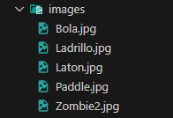
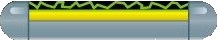
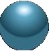
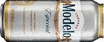
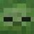
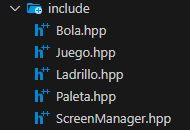
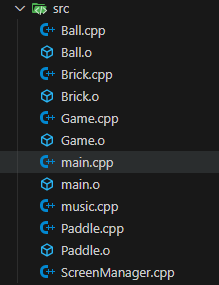
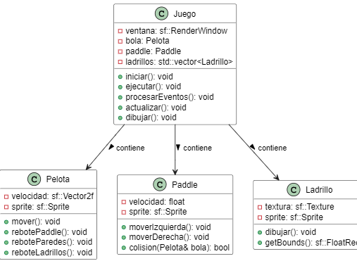
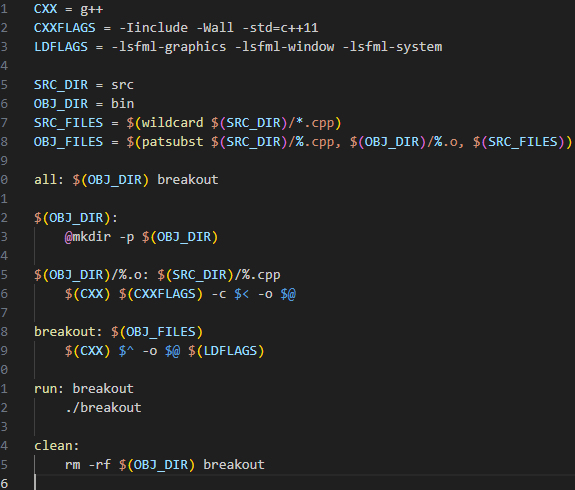

# proyecto-breakout

## 
## Imagenes del juego 
### 
### 
###    
### 
### 
### 

## 
## carpeta include
### 

##
## Carpeta src
### 

##
## diagrama UML
### 

## 
## El makefile
###  

##
## Video del juego
### <video controls src="assets/readme/Ball.cpp - proyecto-breakout [Codespaces_ glowing space spork] - Visual Studio Code y 4 páginas más - Personal_ Microsoft​ Edge 2024-06-20 00-19-45.mp4" title="Title"></video>